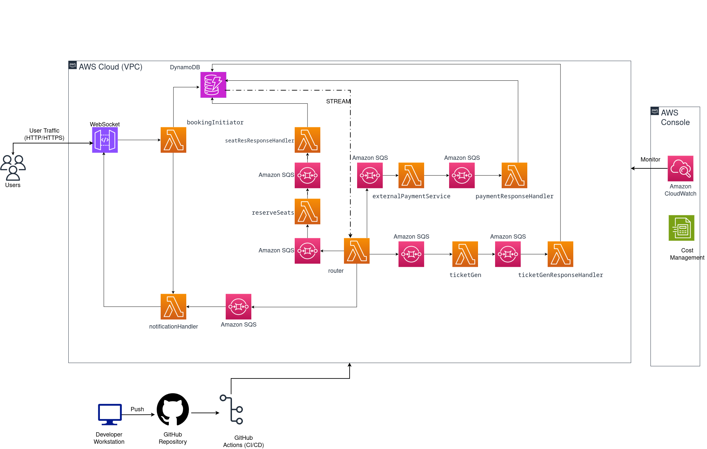

# Cloud-Native Ticket Booking System

This project is a ticket booking application designed to run on the cloud.
It uses a Microservice architecture.

The goal of this project is to demonstrate a production-ready setup using AWS services.
It ensures the application is scalable, reliable, and cost-aware.

## System Architecture

The system is deployed inside a Virtual Private Cloud (VPC) on AWS to ensure security.



### Short Architecture Overview

The application is run using AWS Step Functions, which coordinates Lambda Functions that communicate via SQS and Lambda Invocations.
AWS RDS is used as database.

## Automation (CI/CD)

We use **GitHub Actions** to automate the deployment process:

1.  Build: Compiles the code and allows for running tests.
2.  Package: Stores artifacts of the compiled code.
3.  Deploy: Uploads the images to AWS Lambda Functions, making them ready for deployment.

## Testing

### Example Client

An example client can be deployed by navigating to `/examples` and running

`npx serve .`

In a browser, navigate to `localhost:3000` and open the client.
From there, follow the instructions on the webpage.

### (OLD) curl

When deployed, a ticket can be generated as follows:

```
curl -i -X PUT "https://[GATEWAY-URL]/ticket"
```

Two types of simulated failures are currently supported, and they can be tested using

```
curl -i -X PUT "https://[GATEWAY-URL]/ticket?simulateBookingFailure=seats"
```

```
curl -i -X PUT "https://[GATEWAY-URL]/ticket?simulateBookingFailure=ticket"
```

### Load tests

To simulate various levels of load, the `artillery` package can be used to execute load tests found in `tests/load_tests`:

```
artillery run tests/load_tests/[TEST_NAME].yaml
```
