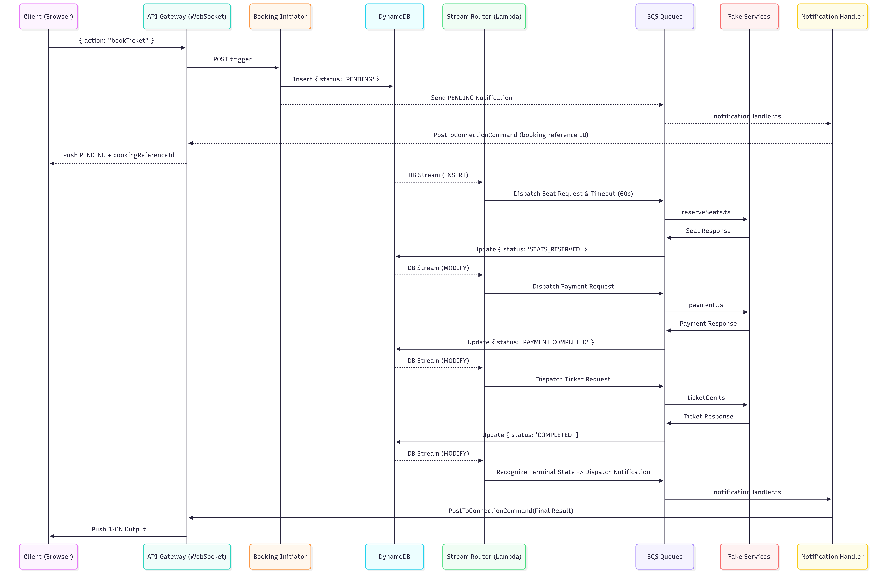

# Code Flow Through Workflow

This document outlines the end-to-end flow of the Ticket Booking application.
The system is a combination of AWS API Gateway (WebSocket & HTTP), Lambda, SQS, and DynamoDB services.

## Architecture

Instead of a centralized orchestrator such as Step Functions, the booking state transitions are driven by DynamoDB Streams.
Every time a booking record is inserted or updated in the `BookingTable`,
a central router (`streamRouter.ts`) evaluates the new state and dispatches the next action via Amazon SQS.

---

## Successful Path

This section shows the code flow of the booking process in case of a successful booking.

### Phase 1: Initiation

1. **Client Connects:** The client establishes a WebSocket connection with API Gateway.
   The `$connect` route is handled by an inline Lambda returning `200 OK` to let the client know the connection has been established.
2. **Action Request:** The client sends a JSON payload: `{"action": "bookTicket"}`.
3. **Initiator (`bookingInitiator.ts`):**
   - API Gateway routes this to the `BookingInitiator` Lambda.
   - It captures the connection ID and uses the API Gateway Request ID as the `bookingReferenceId`.
   - It inserts a new item into DynamoDB with `status: 'PENDING'`.
   - It sends a `PENDING` status payload to the `NOTIFICATION_QUEUE` to report the `bookingReferenceId` to the client.
   - It also dispatches a message to the `NOTIFICATION_QUEUE` with the `bookingReferenceId` and status `PENDING`
4. **Pending Notification (`notificationHandler.ts`)**
   - `notificationHandler.ts` will send the `bookingReferenceId` to the client so it can request status via HTTP if WebSocket connection is lost.

### Phase 2: State Routing (The "Engine")

5. **Stream Router (`streamRouter.ts`):**
   - The DynamoDB `INSERT` event triggers the `StreamRouter` Lambda.
   - It evaluates that `status === 'PENDING'` and dispatches two SQS messages:
     1. A reservation request to `SEAT_RESERVATION_REQUEST_QUEUE`.
     2. A timeout event to `TIMEOUT_QUEUE` with a `DelaySeconds: 60` (to clean up zombie workflows in case of failure).

### Phase 3: Fake Services & Callbacks

6. **Seat Reservation (`reserveSeats.ts` (external) & `seatReservationResponseHandler.ts`):**
   - The `reserveSeats` Lambda reads from the SQS request queue, simulates a successful reservation (generates a `reservationId`), and posts the result to the response queue.
   - The `seatReservationResponseHandler` Lambda picks this up and updates the DynamoDB item to `status: 'SEATS_RESERVED'`.
7. **Payment (`payment.ts` (external) & `paymentResponseHandler.ts`):**
   - DynamoDB Stream sees the change -> `StreamRouter` routes `SEATS_RESERVED` -> Sends message to `PAYMENT_REQUEST_QUEUE`.
   - The `payment` Lambda performs a payment, generates a `paymentConfirmationId`, and replies via SQS.
   - The `paymentResponseHandler` updates DynamoDB to `status: 'PAYMENT_COMPLETED'`.
8. **Ticket Generation (`ticketGen.ts` (external) & `ticketGenResponseHandler.ts`):**
   - DynamoDB Stream sees the change -> `StreamRouter` routes `PAYMENT_COMPLETED` -> Sends message to `TICKET_GEN_REQUEST_QUEUE`.
   - The `ticketGen` Lambda generates a `ticketId` and replies via SQS.
   - The `ticketGenResponseHandler` updates DynamoDB to `status: 'COMPLETED'` and `success: true`.

### Phase 4: Resolution

9. **Final Notification (`streamRouter.ts` & `notificationHandler.ts`):**
   - DynamoDB Stream sees the state change to `COMPLETED`.
   - `StreamRouter` recognizes `COMPLETED` as a terminal state.
   - It collects the final booking data (IDs, success status) and pushes it to the `NOTIFICATION_QUEUE`.
   - The `notificationHandler` Lambda receives this message and uses the `ApiGatewayManagementApiClient` to push the final JSON response directly to the client's open WebSocket connection.

### Diagram

A diagram is provided to visualise the code flow.
The dotted lines during the first `Notification Handler` interaction show that this process is asynchronous,
and happens at the same time as the rest of the workflow.
The `DB Stream` events are dotted to show that these are implicit invocations via DDB's `stream` option.

Mermaid Diagram for code flow

---

## Edge Cases & Error Handling

### Client Disconnection / HTTP Fallback

If the user's WebSocket drops midway through the transaction, the `notificationHandler` will catch an exception when attempting to push data, but the backend process continues.

- **HTTP API (`public-endpoint-nodejs/src/index.ts`):** The client can request their status by calling `GET /ticket/{bookingReferenceId}` via the HTTP API Gateway. This triggers the `PublicEndpoint` Lambda, which performs a direct `GetCommand` against the DynamoDB table, returning the latest state.

### Simulated Failures

If the client passes `simulateBookingFailure: "seats"` or `"ticket"`, the respective Fake Service Lambda explicitly forces a failure response:

- `seatReservationResponseHandler` updates DB to `FAILED_SEATS_UNAVAILABLE`.
- `ticketGenResponseHandler` updates DB to `FAILED_TICKET_ERROR`.
- In both cases, the `StreamRouter` sees a terminal state and immediately alerts the client, skipping further steps.

### Zombie Workflows / Timeouts

In Phase 3 (Initiator), a message was sent to the `TIMEOUT_QUEUE` with a 60-second delay.

- After 60 seconds, the `timeoutHandler` reads this message.
- It attempts a conditional update on DynamoDB. If the status is still in a transitional state (`PENDING`, `SEATS_RESERVED`, or `PAYMENT_COMPLETED`), it changes the status to `FAILED_PAYMENT_TIMEOUT`.
- If the workflow already finished, the Conditional Expression fails (`ConditionalCheckFailedException`), and the handler ignores it.
